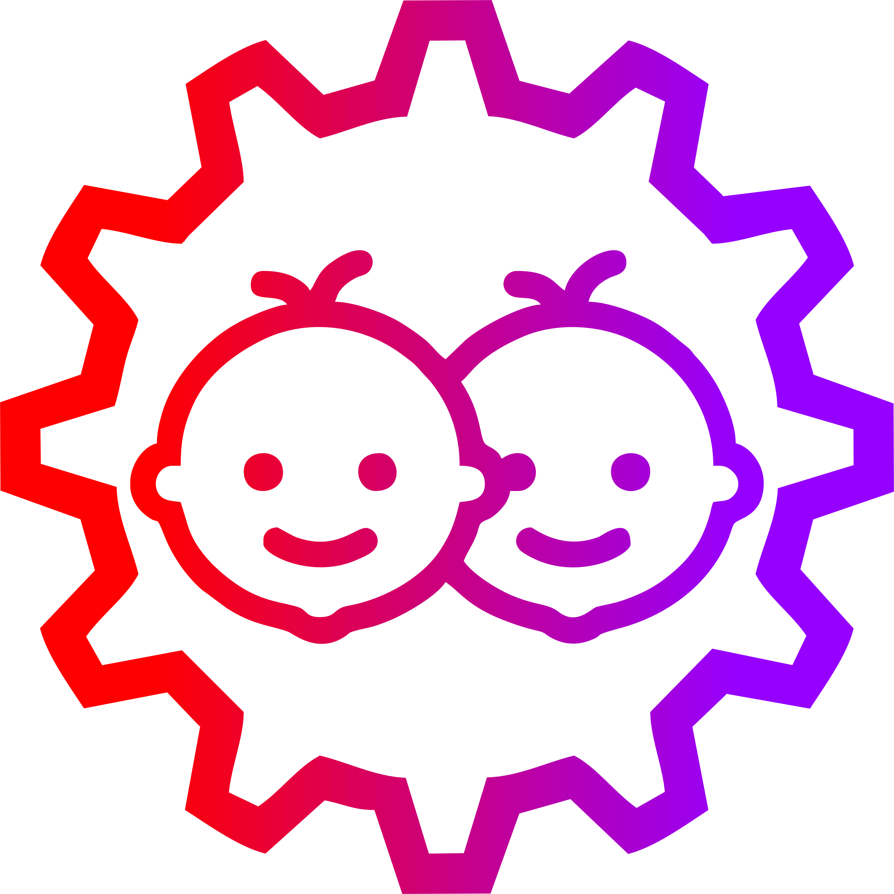

 
  
  
  

  

:thinking: **Our real names:** Tanmay Vilas Samak & Chinmay Vilas Samak

:wink: **Fun fact:** We are identical twins

:slightly_smiling_face: **Ask us about:** Robotics and autonomous systems

<h1 align="left">The Brand:</h1>

 

**Tinker Twins:** [Chinmay Samak](https://www.linkedin.com/in/samakchinmay) and [Tanmay Samak](https://in.linkedin.com/in/samaktanmay) are twin brothers, who use "[Tinker Twins](https://tinker-twins.github.io)" as a personal brand. The twins have come a long way tinkering with various tools and technologies, which has strengthened their scientific knowledge as well as technical and interpersonal skills. The duo has worked on various projects ranging from microelectromechanical systems (MEMS) to in-orbit space settlements, and almost everything in between. They have a particularly keen interest in the field of robotics and autonomous systems, and are specializing in the field of autonomous vehicles.

 
<h1 align="left">The Twins:</h1>

 

**Tanmay Samak:** I received the [B.Tech. degree in Mechatronics Engineering](https://www.srmist.edu.in/program/b-tech-mechatronics-engineering/) with a silver medal from [SRM Institute of Science and Technology](https://www.srmist.edu.in/) in 2021. Having worked on several research projects in the field of autonomous vehicles, complemented with a solid background in mechatronics engineering, I have joined [ARMLab](http://cecas.clemson.edu/armlab-cuicar) at [CU-ICAR](https://cuicar.com/) as a direct Ph.D. candidate under the supervision of [Dr. Venkat Krovi](https://www.linkedin.com/in/venkatnkrovi) to pursue focused research in the field of vehicle automation. My research interests include autonomy-oriented modeling, estimation and simulation methods aimed at bridging the real2sim gap to develop physically and graphically accurate digital twins. I am contributing towards projects such as [VIPR-GS](https://cecas.clemson.edu/VIPR-GS/), [OpenCAV](https://sites.google.com/view/opencav/), [AutoDRIVE](https://autodrive-ecosystem.github.io/), [F1Tenth](https://f1tenth.org/) and [Autoware](https://autoware.org/).

 

**Chinmay Samak:** I received the [B.Tech. degree in Mechatronics Engineering](https://www.srmist.edu.in/program/b-tech-mechatronics-engineering/) with a gold medal from [SRM Institute of Science and Technology](https://www.srmist.edu.in/) in 2021. Having worked on several research projects in the field of autonomous vehicles, complemented with a solid background in mechatronics engineering, I have joined [ARMLab](http://cecas.clemson.edu/armlab-cuicar) at [CU-ICAR](https://cuicar.com/) as a direct Ph.D. candidate under the supervision of [Dr. Venkat Krovi](https://www.linkedin.com/in/venkatnkrovi) to pursue focused research in the field of vehicle automation. My research interests lie at the intersection of physics-informed and data-driven methods to bridge the sim2real gap using digital twins. I am contributing towards projects such as [VIPR-GS](https://cecas.clemson.edu/VIPR-GS/), [OpenCAV](https://sites.google.com/view/opencav/), [AutoDRIVE](https://autodrive-ecosystem.github.io/), [F1Tenth](https://f1tenth.org/) and [Autoware](https://autoware.org/).

 
<h1 align="left">Let's Connect:</h1>

  
  
  
  
  
  
  
  
  
  
  
  

<h1 align="left">Software Development Skills:</h1>

  
  
  
  
  
  
  
  
  
  
  
  
  
  
  
  
  
  
  
  
  
  
  
  
  

<h1 align="left">Hardware Prototyping Skills:</h1>

  
  
  
  
  

  
  
  
  
  
  
  
  
  
  
  

<h1 align="left">Profile Stats:</h1>

